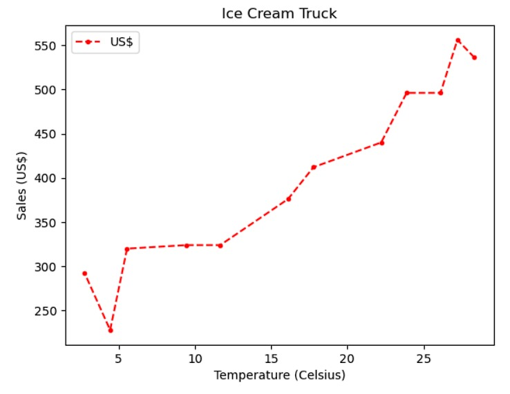

# DS_IceCream

Projeto para estudos de Data Science utilizando Python.

## Sobre 

Este projeto tem como objetivo analisar a relação entre a temperatura e as vendas de sorvetes utilizando bibliotecas populares de Data Science em Python: Pandas e Matplotlib. Como parte do projeto, um gráfico é criado para visualizar a relação entre a temperatura (eixo X) e as vendas (eixo Y). Este gráfico é então exportado em formato PDF.


## Dataset

O dataset `IceCreamData.csv` possui as seguintes colunas:
- Temperature: Temperatura em Celsius
- Sales: Vendas do negócio

## Tarefas

1. Carregar o dataset.
2. Plotar um gráfico com a temperatura no eixo X e as vendas no eixo Y.
3. Exportar o gráfico em formato PDF.

## Screenshots



## Passos para Instalação

1. **Clone o repositório**

    ```sh
    git clone https://github.com/seu-usuario/DS_IceCreamSalesProject.git
    ```

2. **Navegue até o diretório do projeto**

    ```sh
    cd DS_IceCreamSalesProject
    ```

3. **Crie um ambiente virtual (opcional, mas recomendado)**

    ```sh
    python3 -m venv env
    source env/bin/activate  # Para Linux e macOS
    .\env\Scripts\activate  # Para Windows
    ```

4. **Instale as dependências**

    ```sh
    pip install pandas matplotlib jupyterlab
    ```

5. **Inicie o Jupyter Lab**

    ```sh
    jupyter lab
    ```

## Uso

1. Abra o arquivo `IceCream.ipynb` no Jupyter Lab.
2. Execute as células para carregar e analisar os dados de vendas de sorvete.
